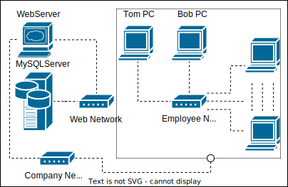
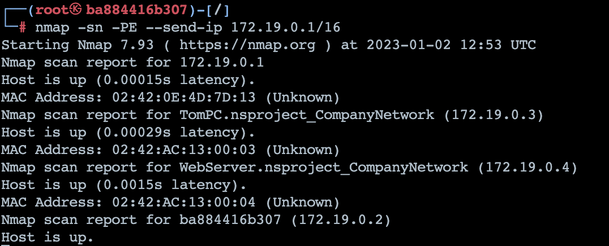
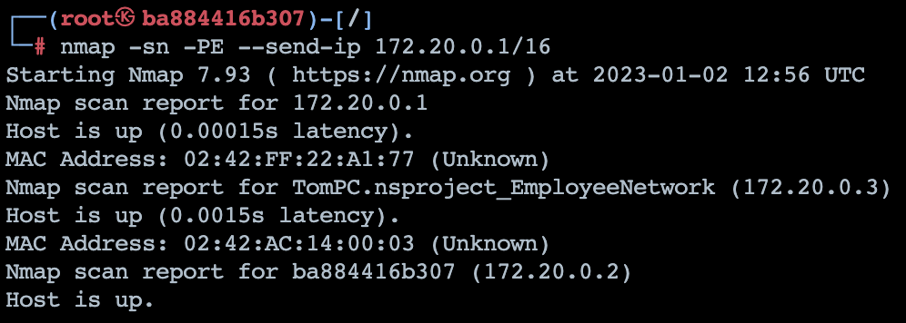
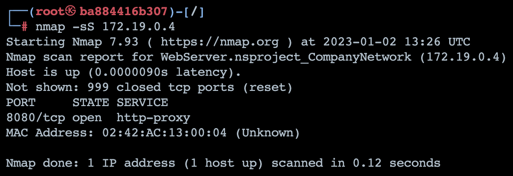
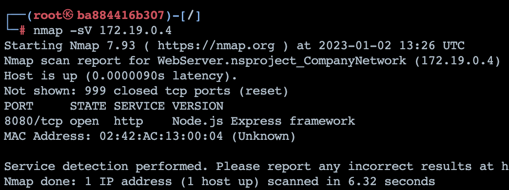
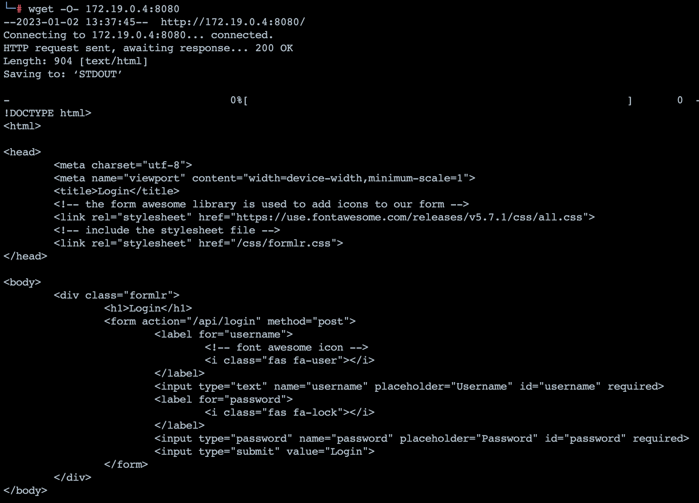

# NetworkSecurity-Project

Network Security project about SSH, Database and SQL Injection.

# Network Scheme


*  Sql Network
    1. Web Server hosting a stub site using NodeJS
    2. MySQL Server hosting sensitive information
*   Employee Network
    1. BobPC which represent the hacker host
    2. TomPC which represent the target host
* Company Network
    1. All the Employee network
    2. Web Server

# Background Scenario

This lab is about a industrial espionage, represented by Bob, who is infiltrated inside a company lan network and found, among a lot of other devices, one vulnerable computer that belongs to Tom and an useful site open ONLY inside the company network.

During the demostration scenario we found out these IP:
- *172.19.0.1* - Company Network
- *172.19.0.2* - Bob PC on company network
- *172.19.0.3* - Tom PC on company network
- *172.19.0.4* - Web Server on company network
- *172.20.0.1* - Employee Network
- *172.20.0.2* - Bob PC on employee network 
- *172.20.0.3* - Tom PC on employee network

And we don't have any access to the Web network


# Instruction how to do it
1. Footprinting: gather information online about the organization
2. Scanning: scan vulnerable point of access
3. Enumeration: probing more intrusive of vulnerable services
4. Exploitation:  attacking those potential vulnerability
## Footprinting
In this case scenario we're already connected to the local network, so we've already gathered enought information about our target

## Scanning
We start find out our IP address on the networks using ```ifconfig``` command, and we found out.

Using then nmap tool with these options:
* “-sn” means “no port scan”
* “-PE” sends ICMP Echo Request
* “--send-ip” to not send ARP packets

We found out some host IP:

***Company Network***


***Employee Network***


## Enumeration
We're interested in the Web Server and in Tom PC, so we can scan more aggressively to find about any open port

If we use simply a TPC SYN scan from nmap, we find vague information:



Else, if we explore more with a Version Detection scan, we can scan even beyond the typical use of a port like 8080:


and we find about a web server open on port 8080

Now we can find about this site (in a real case scenario we should use DirBuster to map the entire site) and the main page.


## Exploitation

# SQL Injection Procedure

`" OR 1<2; -- `
